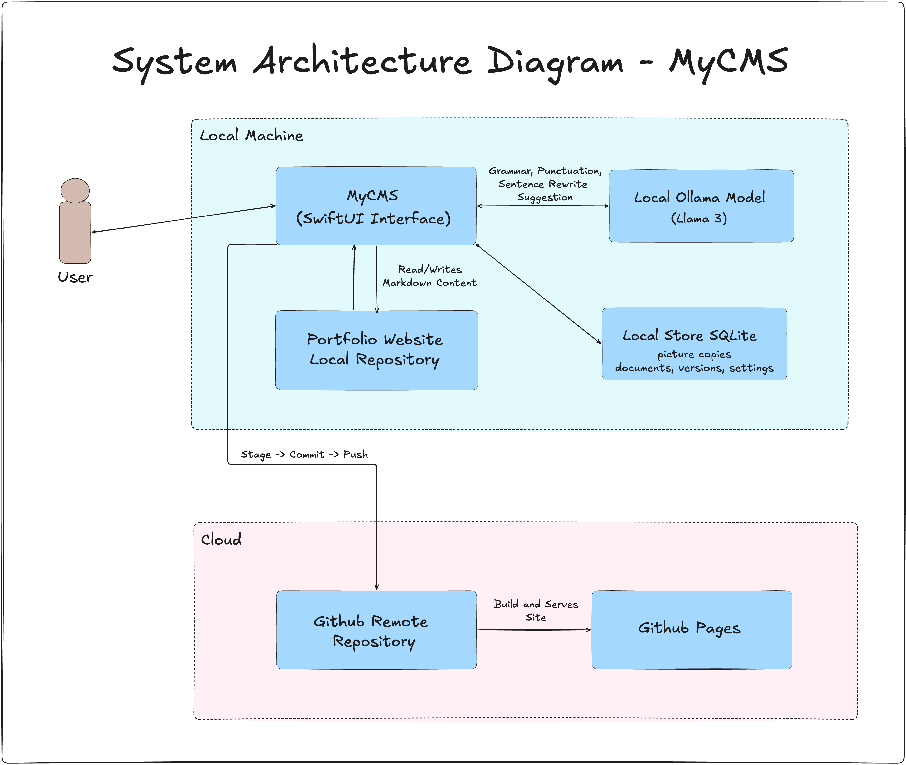

# MyCMS

A native macOS Content Management System (CMS) for writing the posts and project pages on my portfolio site, and publishing them straight into the site's repository as Markdown.

It exists because the site is a static Astro project, and editing it meant opening a code editor,
writing frontmatter by hand, copying pictures into the right folder, and remembering the shape of
every field. This app is the writing surface that does all of that for me. 

## What it does

- **Write.** A Markdown editor with live styling, a formatting toolbar, images by drag, drop or
  paste, and autosave. Every save keeps a version you can restore.
- **Publish.** Validates the document, shows exactly which files change, then writes, commits and
  pushes to the site repository in one commit.
- **Take it back.** Unpublish removes the post and its pictures from the site and keeps every word
  in the app. Change address moves a live post and leaves a redirect behind.
- **Two collections.** Blog posts, and projects with their own fields (role, timeline, status,
  tech, links).
- **Import what is already there.** On launch it adopts files added to the repository by hand, and
  flags anything edited outside the app instead of overwriting it.
- **Suggestions, optional.** Grammar, punctuation and rewrite suggestions from a local Ollama
  model. Every suggestion is checked against the paragraph before it is shown, and nothing is
  applied without a click.

---

## Why it is built this way

**Decision, September 2026: Creating a native macOS app that owns a local database of documents and writes the site's files itself, through git.** 

Three things kept going wrong before: 
- Every page on my website is a Markdown file, so a typo in the frontmatter (the settings block at the top of each file) only got caught later, when the site was built.
- Pictures in the wrong folder or referenced with the wrong relative path.
- No way to take a post back down without repeating all of it in reverse.

What I did not do, and why:

- **A hosted CMS** (Contentful, Sanity, Strapi). A service to pay for and keep alive, an account to manage, and my content living somewhere I do  not control, for one person writing a few times a year.
- **Editing the repository by hand.** Free, and the thing that was already going wrong.
- **A web app I run locally.** A browser tab pretending to be an app, plus a local server to start before writing anything. On macOS a native app is less to run and better at the parts that matter here: a real text view, drag and drop, and file access.
- **No database at all, just git** (read the repository on every launch instead of keeping SQLite). Simpler to explain, but then a draft is either a commit nobody wants to see or a file sitting outside version control, and every search means walking through folders. A local database keepscdrafts private and makes the library open instantly.

### How the pieces fit



There are two separate stores, and each one has an owner.

**The app owns the local store.** SQLite plus a folder of pictures, both in Application Support on
this Mac. Every draft, every saved version, every setting and a copy of every picture lives there.
Nothing in it is ever committed, so unfinished writing stays private.

**The site owns the portfolio repository.** That folder is the published truth. Only two parts of
the app go near it, and they go in opposite directions: `Repository/` only reads from it (scanning,
importing, noticing files edited by hand), and `Publish/` is the only thing allowed to write to it.

### The rules that keep it safe

The app changes files in a repository that my live site is built from, so a mistake ships. These
nine rules are what stop that, and each one is enforced in code rather than by being careful.

1. **Only one thing writes.** Every change to the site repository goes through `Publisher`.
   Publishing, unpublishing and changing an address are all just different plans it runs, so the
   same safety checks and the same undo cover all three.
2. **Decide everything before writing anything.** A `PublishPlan` is the full list of files that
   will be written, copied or deleted, worked out up front. You see that list, git is handed exactly
   that list, and if something fails, exactly that list is put back.
3. **Three folders, nothing else.** `src/content/`, `src/assets/` and `src/redirects.ts`. A path
   anywhere else stops the app before a single byte is written.
4. **Say what you are about to do, before doing it.** A row is saved to the `publishes` table
   before the first file is touched. If the app is quit or crashes halfway, the next launch finds
   that row and offers to finish the job or throw it away, instead of leaving the repository half
   changed.
5. **Never lose a picture.** The app keeps its own copy of every picture, which is what makes it
   safe for unpublishing to delete the copies in the repository. If it finds a picture in a post's
   folder that it has no copy of, it stops and names the file rather than deleting something it
   cannot give back.
6. **Never lose words.** Unpublishing takes the post off the site, and that is all. The document
   goes back to draft with its text, its saved versions, its pictures, its address and its original
   publish date untouched.
7. **Only a draft can be deleted.** The database itself refuses to delete a published document. The
   button is hidden too, but hiding a button is not what makes it safe.
8. **An address freezes once it is live.** Before publishing, editing the title updates the web
   address. After publishing it stops doing that, because the old address is out in the world.
   Moving a live post means using Change address, which leaves a redirect behind.
9. **The AI never edits anything.** It only suggests. Any suggestion whose text does not actually
   appear in the paragraph, or that tries to do more than its job (a spelling fix rewriting a
   sentence), is thrown away before it reaches the screen. Applying one is always a click by you.

## How publishing works

1. **Validate.** Title, subtitle, address, tags, cover alt text, every picture, and for a project
   its role, timeline and status.
2. **Preflight.** If anything changed outside `src/content/`, `src/assets/` and `src/redirects.ts`; the
   branch is `main`; a pull fast forwards.
3. **Plan.** Every file the publish will write, copy or delete, decided up front and shown to you.
4. **Record the intent,** so an interrupted run is found and offered Finish or Discard next launch.
5. **Write, stage each path by name, commit, push.**

---

## Want to Run it locally ?
## Requirements

- macOS 26 or later, Xcode 26 or later (Swift 6)
- [Ollama](https://ollama.com) if you want the suggestions. The app runs fine without it.
- [SwiftLint](https://github.com/realm/SwiftLint) if you want the house rules checked:
  `brew install swiftlint`

## Build and run

```bash
git clone https://github.com/PrashantMaht0/MyCMS.git
cd MyCMS
cp Config/Local.xcconfig.example Config/Local.xcconfig   # then add your Team ID
open MyCMS.xcodeproj
```

Press ⌘R in Xcode. `Config/Local.xcconfig` holds the Apple Developer Team ID and is gitignored, so
signing settings never land in a commit. Without a Team ID you can still build unsigned:

```bash
xcodebuild -project MyCMS.xcodeproj -scheme MyCMS -configuration Debug CODE_SIGNING_ALLOWED=NO build
```

Tests:

```bash
xcodebuild -scheme MyCMS -destination 'platform=macOS' test
```

Install it like a normal app:

```bash
./scripts/make-dmg.sh      # writes build/MyCMS-<version>.dmg, then drag it into Applications
```

The disk image is signed with the development identity on local Mac device, not notarised, so it is meant
for local machine only. A copy that arrives by download or AirDrop will be blocked by Gatekeeper.

## First run

Setup asks for the site repository folder, then checks it is a git repository on `main`, with a remote and both content folders. After that, launching scans the repository, imports anything new, and opens the library.

---

## Want to contribute?
See [Contribute](CONTRIBUTING.md)

---

## Licence

MIT, see [LICENSE](LICENSE). Source Serif 4 ships inside the app under the SIL Open Font License; its licence travels with it at `MyCMS/Resources/Fonts/LICENSE.md`.
